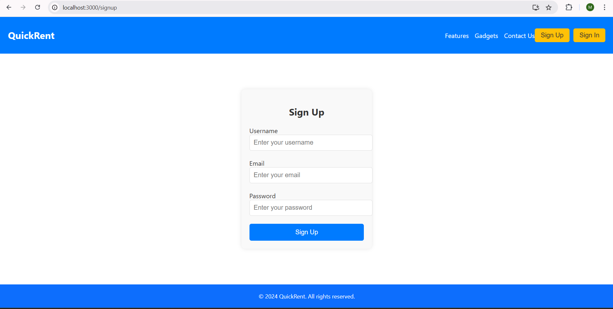
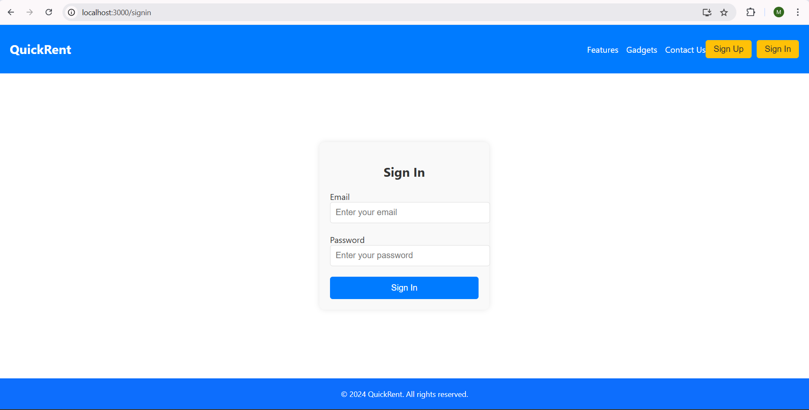
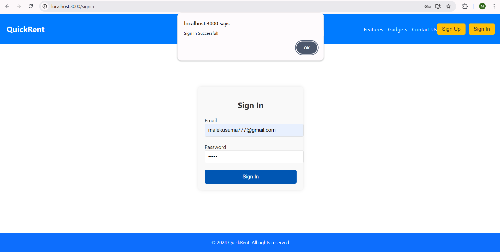
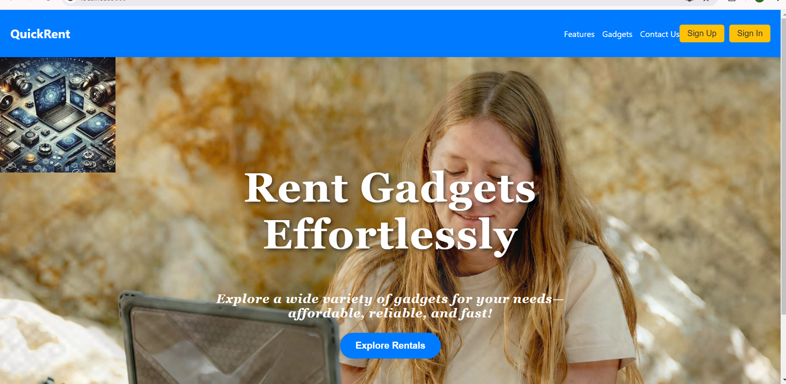
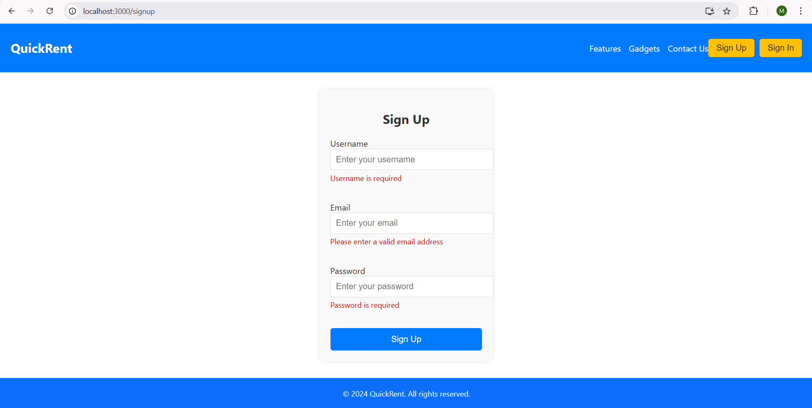
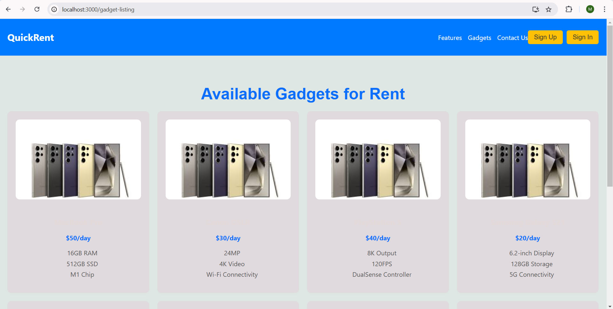
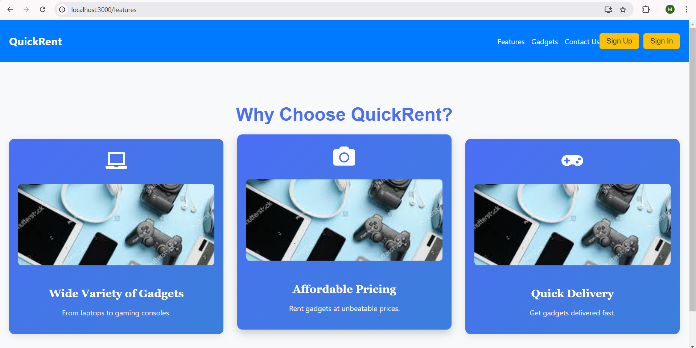
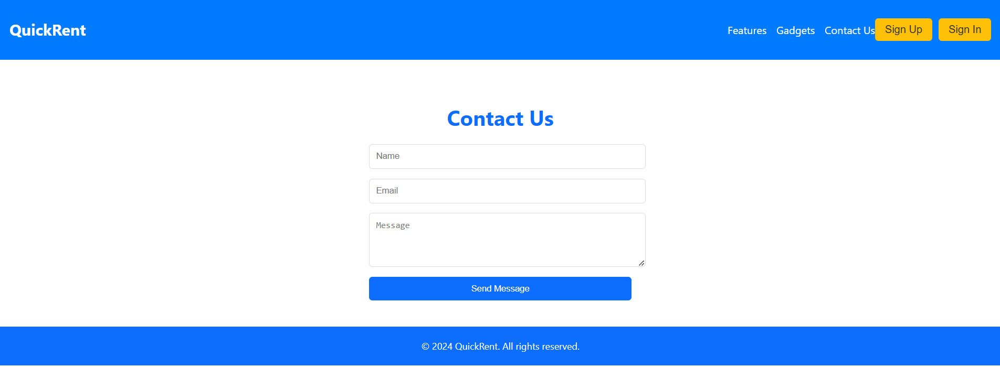

# QuickRent Project

## Description
QuickRent is a website designed for gadget rentals. It includes a responsive navigation bar, signup, and signin pages.

## Approach
- Implemented React Router for page navigation.
- Designed responsive UI using CSS Flexbox.
- Added routing for Signup and Signin pages.
- Deployed the website using a hosting platform.


## Setup Instructions
1. Clone the repository:
   ```bash
   git clone https://github.com/malekusuma/quickrent-project.git
   cd quickrent-project


## Screenshots











